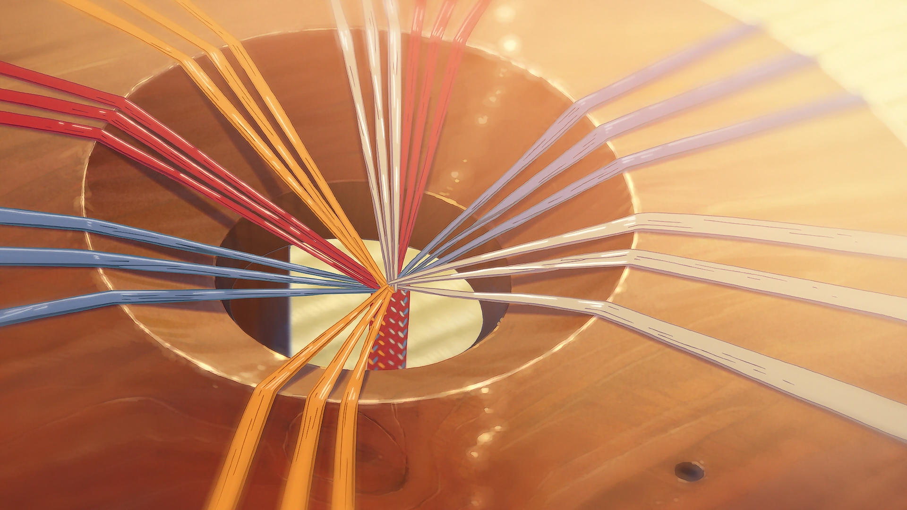

# 数字组纽台 (Digital Kumihimo)

这是一个基于 Web 技术的交互式日本组纽（Kumihimo）编织模拟器。灵感来源于电影《你的名字。》。

## ✨ 功能特性

- **交互式丸台**: 通过点击操作，模拟真实的编织流程。
- **多种编织方案**: 内置“金刚组”和“角八つ組”等经典模式，并可通过 JSON 文件轻松扩展。
- **双重实时预览**: 同时提供“松散过程”和“拉紧效果”两种预览图，直观展示编织过程与最终成品。
- **进度跟踪与控制**: 清晰的进度条、步骤计数，支持撤销和重置操作。
- **响应式布局**: 优雅地适应不同屏幕尺寸。

## 🚀 线上体验

[点击这里访问线上版本](https://你的用户名.github.io/你的仓库名/) 
<!-- 稍后我们会把这里的链接换成真实的 -->

## 🛠️ 如何使用

1. 打开网站。
2. 在弹出的模态框中选择一个你感兴趣的编织方案。
3. 根据高亮提示，点击需要移动的“玉”。
4. 再点击高亮提示的目标空位，完成一步编织。
5. 在右侧的预览区查看实时生成的图案。
